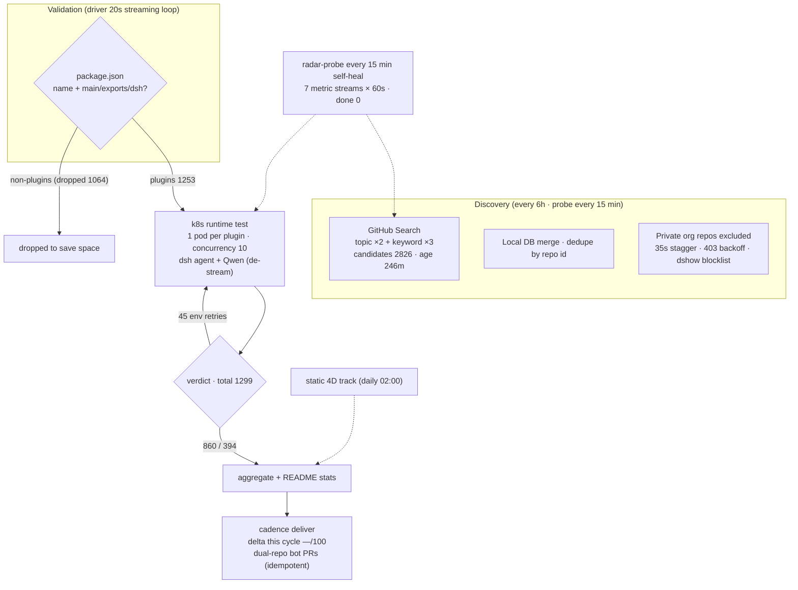

# Awesome DSH Plugins

   
  
  
  
  
  
  

**A daily-updated radar that auto-discovers and compatibility-tests every plugin for DeepSeek Harness.**
Know which plugins work before you install them.

   

   

[English](README.en-US.md) | [简体中文](README.md)

---

**What is this?** DeepSeek Harness (DSH) is an open-source coding agent where everything is a plugin. This repo is a **radar** that automatically tracks its plugin ecosystem — **1253 plugin repos indexed** (clone-verified package.json), **1299 runtime-tested on the k8s track**.

## How it works

<!-- AUTO:pipeline:START -->

<!-- AUTO:pipeline:END -->

## Quick Start

| Goal | Link |
|---|---|
| Browse Star Top 20 | [ Star Top 20](#star-top-20) |
| Find a plugin by use case | [ Plugin Catalog](#plugin-catalog) · [PLUGINS.md](PLUGINS.md) — 9 categories, compat status per plugin |
| Browse all auto-discovered repos | [ Ecosystem Snapshot](#ecosystem-snapshot) — dated compatibility matrix |
| See what changed recently | [ CHANGELOG](CHANGELOG.md) |
| Register or submit a plugin | [ For Plugin Developers](#for-plugin-developers) · add the `dsh-plugin` topic → discovered within 8h · [PR template](.github/PULL_REQUEST_TEMPLATE.md) |
| Maintain this radar | [ Automation SOP](docs/SOP.md) |
| Plugin user guide | [ For Plugin Users](#for-plugin-users) |
| How we assess compatibility | [ How We Assess Compatibility](#how-we-assess-compatibility) |
| Join the community | [ dshfind.com](#dsh-learning-community-dshfindcom) · [Discussion group](#community-discussion-group) |

> [!IMPORTANT]
> **Inclusion ≠ compatible, static check ≠ runtime-usable, runtime-usable ≠ security-audited.**
> This repo provides traceable filtering signals, not official DSH endorsement. Always review plugin source, permissions, dependencies, and license before installing.

##  Star Top 20

<!-- AUTO:featured:START -->

> 按 GitHub star 数排序，每 20 分钟自动刷新。数据截至 2026-08-16 19:53（UTC+8）。

| # | 插件 |  | 说明 |
|---|---|---|---|
| 1 | [headroom](https://github.com/headroomlabs-ai/headroom) | 66493 | Compress tool outputs, logs, files, and RAG chunks befo… |
| 2 | [dsh-web-ui](https://github.com/zhu1090093659/dsh-web-ui) | 3143 | Plugin and skin collection for DeepSeek Harness (DSH) W… |
| 3 | [modlens](https://github.com/liustack/modlens) | 2191 | The first vision plugin for DeepSeek Harness, and the v… |
| 4 | [DSH-better-sidebar](https://github.com/omdsh-dev/DSH-better-sidebar) | 1483 | 开放的侧边栏底座，支持三方拓展注册新侧边栏页面。内置文件渲染编辑/终端/Git/子代理页面 |
| 5 | [dsh-TUI](https://github.com/ccch1mneyyy/dsh-TUI) | 1438 | DSH 官方公众号收录的 TUI 补位插件：Claude Code 风，鲸鱼顶栏/实时状态/流式思考/双击 E… |
| 6 | [TokenTracker](https://github.com/xiufengsun/TokenTracker) | 1327 | Local-first AI token usage & cost tracker for 31 coding… |
| 7 | [PicGo-Core](https://github.com/PicGo/PicGo-Core) | 974 | :zap:The ultimate image uploading engine. Both CLI & AP… |
| 8 | [sandbase-harness](https://github.com/sandbaseai/sandbase-harness) | 598 | Open-source CMA-compatible agent runtime for any model,… |
| 9 | [dsh-vision-toolkit](https://github.com/Anionex/dsh-vision-toolkit) | 485 | 让纯文本模型更好地做视觉任务的DeepSeek Harness插件：带意图的图片问答、长截图 OCR、UI 还… |
| 10 | [dsh-ads](https://github.com/Nagi-ovo/dsh-ads) | 445 | 把 DSH 变成 2005 年门户网站｜Parody ads, fake games, and popups … |
| 11 | [dsh-agent-teams](https://github.com/NanmiCoder/dsh-agent-teams) | 385 | AgentTeams plugin for DeepSeek Harness |
| 12 | [Abu-Cowork](https://github.com/PM-Shawn/Abu-Cowork) | 329 | Open-source alternative to Claude Cowork — a local-firs… |
| 13 | [dsh-vision-router](https://github.com/ysr666/dsh-vision-router) | 310 | Eyes for text-only DeepSeek Harness agents: built-in fr… |
| 14 | [dsh-at-file](https://github.com/omdsh-dev/dsh-at-file) | 248 | Codex-style @file mentions for DeepSeek Harness: search… |
| 15 | [Bigfish](https://github.com/turtle2209/Bigfish) | 229 | Bigfish —— DeepSeek Harness 的第三方桌面端，内置 Node 运行时，双击即用，附带… |
| 16 | [oh-dsh](https://github.com/hust-open-atom-club/oh-dsh) | 210 | 一套 DSH runtime，Desktop、Web 与 TUI 三种开发体验。 |
| 17 | [deepseek-harness-desktop-app](https://github.com/vibeinging/deepseek-harness-desktop-app) | 209 | DeepSeek Harness Desktop App: a local AI desktop worksp… |
| 18 | [dsh-browser](https://github.com/Lum1104/dsh-browser) | 185 | dsh plugin: Chrome sidebar extension that lets DSH oper… |
| 19 | [dsh-tianshu-tui](https://github.com/huiliyi37/dsh-tianshu-tui) | 184 | dsh-tianshu-tui — 是官方 Dsh web端的交互式终端极简风格 UI 插件。以自研ansi为… |
| 20 | [whale-girl](https://github.com/vlln/whale-girl) | 183 | DSH Web GUI 桌面宠物插件（QQ 宠物形态）：右下角悬浮、可拖拽/投喂/玩耍的积累型伙伴。 |

<!-- AUTO:featured:END -->

## Plugin Catalog

<!-- AUTO:catalog:START -->

Per-plugin details (verdict · location · stars) in **PLUGINS-ALL.md**.

- **🎓 技能包**（19）— OK 13 · incompatible 4 · pending 1 · untested 1 · watching 0 — [details](PLUGINS-ALL.md#-技能包19)
- **🧠 记忆增强**（24）— OK 13 · incompatible 8 · pending 1 · untested 2 · watching 0 — [details](PLUGINS-ALL.md#-记忆增强24)
- **🎨 主题皮肤**（11）— OK 6 · incompatible 1 · pending 3 · untested 1 · watching 0 — [details](PLUGINS-ALL.md#-主题皮肤11)
- **🛒 市场与管理**（50）— OK 33 · incompatible 9 · pending 0 · untested 7 · watching 1 — [details](PLUGINS-ALL.md#-市场与管理50)
- **🔌 Web UI 增强**（455）— OK 272 · incompatible 67 · pending 21 · untested 78 · watching 17 — [details](PLUGINS-ALL.md#-web-ui-增强455)
- **💻 编码开发**（460）— OK 229 · incompatible 69 · pending 12 · untested 120 · watching 30 — [details](PLUGINS-ALL.md#-编码开发460)
- **🤖 Agent 能力**（410）— OK 218 · incompatible 69 · pending 15 · untested 89 · watching 19 — [details](PLUGINS-ALL.md#-agent-能力410)
- **📡 消息通讯**（167）— OK 91 · incompatible 26 · pending 9 · untested 36 · watching 5 — [details](PLUGINS-ALL.md#-消息通讯167)
- **🗂 文件数据**（143）— OK 66 · incompatible 33 · pending 8 · untested 30 · watching 6 — [details](PLUGINS-ALL.md#-文件数据143)
- **🎮 娱乐生活**（75）— OK 48 · incompatible 8 · pending 3 · untested 11 · watching 5 — [details](PLUGINS-ALL.md#-娱乐生活75)
- **🛠 基建部署**（248）— OK 123 · incompatible 73 · pending 9 · untested 27 · watching 16 — [details](PLUGINS-ALL.md#-基建部署248)
- **📚 学习研究**（28）— OK 12 · incompatible 7 · pending 0 · untested 7 · watching 2 — [details](PLUGINS-ALL.md#-学习研究28)
- **❓ 其他**（809）— OK 419 · incompatible 140 · pending 22 · untested 146 · watching 82 — [details](PLUGINS-ALL.md#-其他809)

<!-- AUTO:catalog:END -->

##  DSH Learning Community dshfind.com

[dshfind.com](https://dshfind.com) — Learn DSH principles, discover plugins & share best practices.

[ dshfind.com](https://dshfind.com) · [GitHub](https://github.com/hikariming/dshfind)

## Community Discussion Group

The DSH plugin community discussion group on WeChat: plugin authors, maintainers, and users discuss plugin development, compatibility issues, and new releases.

> The QR code is valid for 7 days (before 2026-08-21).

## For Plugin Users

### 1. Find candidate plugins

- Prefer [PLUGINS.md](PLUGINS.md) — plugins with manual curation and descriptions.
- If the catalog misses it, search the repo name or keywords in the dated [Ecosystem Snapshot](#ecosystem-snapshot) index.
- Treat repos that are inaccessible, lack a README or license, or sit unmaintained as high-risk candidates — not "verified plugins".

### 2. Understand status (unified 4-tier scale)

All entries use a **single runtime scale** (k8s container tests — see the test version note below). The four tiers are mutually exclusive:

| Status | What it says | What it does not say |
|---|---|---|
|  Runtime OK | Actually loaded and completed the verification task under the recorded test version | Not a full functional, performance, or security test |
|  Runtime incompatible | Hard failure — missing deps, read-only sandbox, missing internal packages (3 retries all failed) | Not permanently unusable; the author may have fixed it in a newer version |
|  Pending | Test-environment failure; the verdict is incomplete | **Not partially compatible** — awaiting a retest |
| · Untested | Never dispatched to a runtime test | Do not infer either compatibility or incompatibility |

> [!NOTE]
> **Test version**: dsh (in-container agent) driven by Qwen3.6-35B (via the de-stream proxy) · k8s, 5 shards · each run is anchored by the snapshot `run_id` (currently `20260816T104501Z`). The DSH npm version is not recorded per snapshot — cross-check via run_id and the `reports/agent-test/` dates.
> **Scale note**: "tested N" in badges and stats is the single-run scale; the catalog and full listing use the cross-run cumulative scale — the numbers legitimately differ.

Every conclusion carries four facts: **plugin commit, mainline commit, test date, test level**. If any one is missing, lower your trust in the result.

### 3. Install, verify, and roll back

This catalog is not a package manager and ships no install command verified by this repo. Follow the plugin's own README, ideally in this order:

1. Read the plugin's install, configuration, permission, and uninstall instructions.
2. Pin a plugin version or commit; do not ride a drifting default branch.
3. Load it first in an isolated profile or test environment — no production keys or sensitive data.
4. Run one minimal functional task; record the DSH version, plugin version, and logs.
5. Keep the previous config and lockfile so a failure can be rolled back cleanly.

If the plugin itself misbehaves, report it in the plugin repo first; if a catalog link, category, or status evidence is wrong, open an issue or PR here.

## For Plugin Developers

### Minimum inclusion criteria

The public catalog should list only repos an ordinary visitor can open. An auto-discovered candidate should at least:

- Be publicly accessible and tagged with the `dsh-plugin` topic;
- Have a valid root `package.json` with a non-empty `name`;
- Provide `main`, `exports`, or an explicit `dsh` integration entry;
- Ship a README covering what it does, how to install, how to uninstall, and a minimal usage example;
- Declare every runtime dependency in `dependencies` / `peerDependencies`;
- State the supported DSH version, snapshot, or verified commit;
- Include a license, and never commit secrets, personal data, or private repo content to the public catalog.

Package names should use a namespace you control. Only projects granted `dsh-external` maintainer access should use `@dsh-external/*`; do not squat namespaces owned by others or reserved by the official project.

### A qualified plugin README must include

| Section | Questions it should answer |
|---|---|
| Overview | What problem does the plugin solve, and for whom? |
| Compatibility | Which DSH versions or mainline commits are supported? When was it last verified? |
| Install / Uninstall | How to install, upgrade, disable, and fully remove? |
| Quick start | What is the minimal config and one reproducible example? |
| Configuration | Which settings, defaults, env vars, and sensitive entries exist? |
| Permissions & data | Which files, network endpoints, credentials, or user data does it touch? |
| Troubleshooting | Common errors, log locations, and rollback? |
| Development | How to build, test, and contribute? |
| License & security | Which license? How are security issues reported privately? |

### Submit a plugin

1. Add the `dsh-plugin` topic to your repo and wait for the next scan.
2. Append the plugin name, repo link, and a one-line description under the right category in [PLUGINS.md](PLUGINS.md).
3. Self-check against the minimum criteria above.
4. Open a PR using the [PR template](.github/PULL_REQUEST_TEMPLATE.md), including your test environment and results.

Small PRs that just fix a link, category, description, or status evidence are always welcome. Do not copy private issues, secrets, member lists, or long third-party excerpts into catalog PRs.

## How We Assess Compatibility

| Level | Current check | Fair conclusion |
|---|---|---|
| L0 Discovery | Topic, repo visibility, basic metadata | This is a candidate repo |
| L1 Manifest | `package.json`, name, entry fields | It "looks installable", but loading is unproven |
| L2 Static compat | Patches, extension points (seams), dependency ranges | Known drift signals found, or no blocking signal so far |
| L3 Compile experiment | Type or syntax check in a pinned workspace | Valid only for that build setup; missing deps and environment issues must be separated from real API drift |
| L4 Runtime test | Install, load, minimal task or tool call | Success or failure observed on the recorded environment and commits |

> [!NOTE]
> The front page never merges these levels into one fuzzy "compatibility rate". Static pass, compile pass, and runtime pass use different fields and denominators; full evidence lives in the dated reports.

### Known limitations

- Both mainline and plugins move fast; older conclusions expire quickly.
- A clean static check does not guarantee a successful real run.
- A compile failure may come from the test environment, missing dependencies, or misconfiguration — do not equate it with API incompatibility.
- A runtime success covers only the minimal task in the report — not every feature, platform, or configuration.
- Auto-generated LLM summaries are navigation aids only; they never replace the raw matrices and logs.

## Repository Structure

| Path | Contents |
|---|---|
| `PLUGINS.md` | Manually curated and categorized entry list |
| `reports/<YYYY-MM-DD>/index.md` | Full scan index for that date |
| `reports/<YYYY-MM-DD>/mainline-compat.md` | Static compatibility matrix for that date |
| `reports/<YYYY-MM-DD>/compile-compat.md` | Compile and syntax experiment results for that date |
| `reports/<YYYY-MM-DD>/runtime-test.md` | Runtime-level test results for that date |
| `CHANGELOG.md` | Dated ecosystem change log |
| `docs/SOP.md` | Automation, build, and report maintenance notes |
| `scripts/` | Discovery, checking, testing, and rendering scripts |

Maintainers: README auto-generation conventions

- Manual content lives outside the auto markers; generators only replace `AUTO:ecosystem` blocks.
- The front page shows only summaries and report links, never full repo tables.
- At most 10 new/changed entries are listed; the rest link to `CHANGELOG.md`.
- Repo links must use the full `owner/name` from scan results — never hardcode an org name.
- Auto blocks use real date paths; a plain `reports/LATEST.md` is also generated as a verifiable stable entry that does not depend on directory symlinks.
- When a report is missing, empty, or fails numeric validation, show "data unavailable" — never reuse stale values or draw strong conclusions.
- Runtime and static results use different fields and denominators, and show test coverage counts.

## Ecosystem Snapshot

<!-- AUTO:ecosystem:START -->
> 渲染于快照 20260816T104501Z（2026-08-16 18:45 UTC+8）· 数据源 data/snapshots/（渲染即对齐）

| 证据层 | 当前结果 |
|---|---:|
| 自动收录 | 1253 个仓库 |
| 静态综合判定 | 277 / 286 兼容，9 需适配（静态轨 2026-08-13 · 经快照入仓） |
| 证据不足 | 94 待调研 |
| 其他 | 0 占位 · 0 不适用 · 0 已删除 |
| 运行级实测 | 860 可用 · 394 不兼容 · 45 待定（共 1299 个，k8s agent 口径）|
| 正在跟踪的 PR | 2（快照 deliver 口径） |

[完整索引](reports/2026-08-16/index.md) · [静态矩阵](reports/2026-08-16/mainline-compat.md) · [编译实验](reports/2026-08-16/compile-compat.md) · [运行实测](reports/2026-08-16/agent-test.md)

插件状态明细（按判定分群 · 与上方分类目录互补 · 默认折叠）

** 正在跟踪的 open PR**

| 仓库 | PR | 标题 | 更新 |
|---|---|---|---|
| （暂无公开可访问的 open PR） | | | |

<!-- AUTO:ecosystem:END -->

The snapshot only answers "what does today's evidence say" — the front page never copies hundreds of repo rows and change logs. Per-repo verdicts, failure reasons, daily additions, and open PRs live in the dated reports.

## Boundaries & Credits

This repo maintains the catalog, detection rules, and evidence reports — it does not host third-party plugin code. Thanks to every contributor who submitted plugins, reproduced issues, corrected metadata, and kept the test pipeline alive.

No license has been declared yet; confirm authorization with the maintainers before copying, modifying, or redistributing catalog content and scripts. Maintainers should add an explicit `LICENSE` before public promotion.

Huge thanks to everyone who joined the beta test — the group photo shows only part of the list, and many more friends contributed along the way!

Let's keep deep diving!
